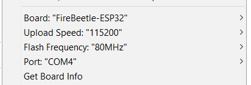

# OPTI
Arduino library for controlling the OPTI camera sliders.

## Important Notice
Please note that the following implementation was made for my own usage and represents the subset of functionalities I needed. If you find it lacking, feel free to submit a merge or feature request. Current implemtation supports OPTI 200 device, but it should be fairly easy to extend the library on others.

## Instalation
1. Follow the instructions for installing Arduino IDE and ESP-32 board core:\
https://github.com/espressif/arduino-esp32/blob/master/docs/arduino-ide/boards_manager.md \

2. Install required libraries in `Sketch > Include Library > Manage Libraries...`:
    *  TMC2208Stepper
    
3. Under the `Tools` dropdown, setup the following:\

> Note: There have been problems reported about uploading at higher speeds. You can use them if it works for you.

## Minimal Usage Example
```
#include <Arduino.h>
#include <Opti200.h>

Opti200 opti(Serial1); // provide a serial for bluetooth communication

void setup()
{
	opti.Initialize();
}

void loop()
{
	opti.Update();
}
```

# Important information on OPTI sliders
## Pin descriptions
```
GPIO 2           // onboard LED
GPIO 15          // shutter release   
GPIO 32          // left border switch  
GPIO 33          // right border switch
GPIO 35          // battery status (in development)    
GPIO  4          // motor driver activation
GPIO 16          // motor step
GPIO 17          // motor direction
```

## Motor Current
1.4 A

## Appropriate Power Supply
5V / 2A with 2,5/5,5 plug
